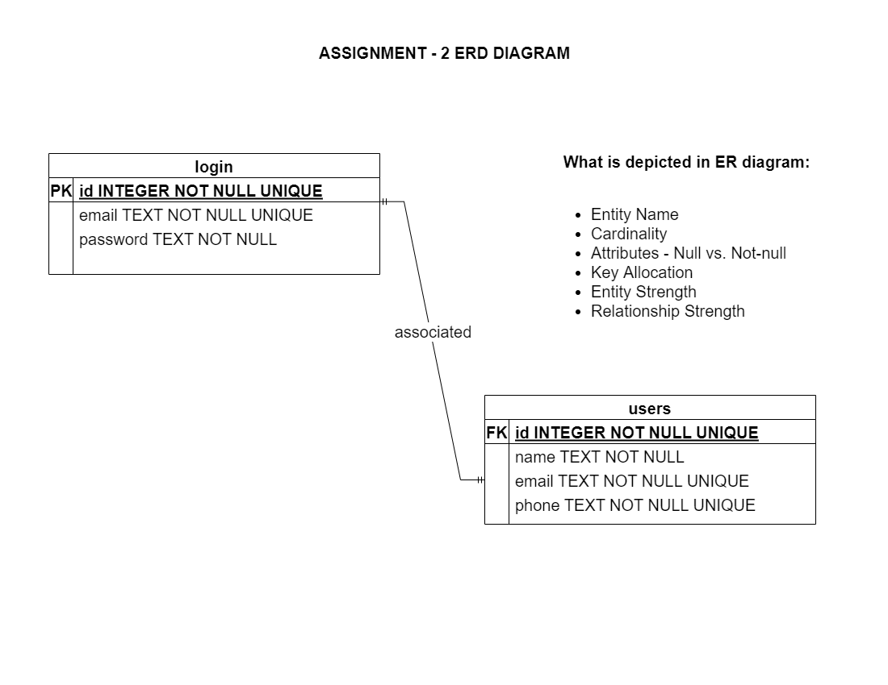

# Cryptoverse

## Introduction

Cryptoverse is a web app I built as my final project for the course CS 484 - Secure Web Application Development instructed by prof. [Chris Fulton](https://www.linkedin.com/in/christopher-fulton-5a053a17). It displays information about the top 100 cryptocurrencies in a card layout. Clicking on the card takes you to a website that displays a lot more details about the cryptocurrency. This is the link to the web app - [Cryptoverse](https://cryptoversefront.herokuapp.com). The link can also be found in the 'about' section on the top right. Some notable features include:

- Built using a microservices-based architecture. Frontend and backend are hosted as two separate containers and they talk to each other via RESTful APIs.
- Dynamic and responsive to all screen sizes.
- Includes a search bar that filters content dynamically.
- Sessions are sent back and forth between the frontend and backend. They are stashed in the database for a persistent store.
- Forgot password page uses Nodemailer to send an OTP to verify the user is who he claims to be.
- Uses CI/CD pipeline built using Github Actions.
- Plots the price change in the last 24 hours on a graph using React Sparklines.

## Github Actions - CI/CD Pipeline

I use [Github Actions] (https://github.com/features/actions) for the CI/CD pipeline. The code for this can be found in the .github/workflows directory. Essentially, pushes to the main branch trigger the following 4 jobs:

`build_back` - Installs and configures node, application dependancies. Builds, runs and tests the application to make sure everything is working as expected.

`deploy_back` - Upon successful tests, this step logs in to Heroku, runs the Heroku commands needed to build a docker container using the Dockerfile in the backend directory and deploys it using my Heroku credentials that are stored as secrets in my repo.

`build_front` - Installs and configures node, application dependancies. Builds, runs and tests the application to make sure everything is working as expected.

`deploy_front` - Upon successful tests, this step logs in to Heroku, runs the Heroku commands needed to build a docker container using the Dockerfile in the frontend directory and deploys it using my Heroku credentials that are stored as secrets in my repo.

A successful commit/build :white_check_mark: requires successful completion of these 4 jobs.

## Technologies Used

These are the primary technologies that were used to build this full-stack application:   

Html, CSS, Javascript, React.js, Node.js, Express.js, Jest.js, Knex.js, Sqlite3, Github Actions, Docker, Heroku, React Sparklines, React Tilt, Nodemailer, Bcrypt.js.

## API

I use the coinranking API to obtain data about crypto. This is the link to the documentation:
[https://developers.coinranking.com/api/documentation/coins](https://developers.coinranking.com/api/documentation/coins)

This is the data I read in:
- Rank, name, code, logo, price of the Cryptocurrency
- Price change in the last 24 hours
- Market cap, change, 24h volume

 ## User authentication & security

 For authentication, I am implementing secure storage of passwords through salting the hashes to add an element of randomness. I am also enforcing strong passwords by accepting only passwords that contain a lowercase, uppercase, number and a special character. The minimum length of the password is also 8 characters.    
 For security, I have implemented a microservices-based architecture. My frontend manages all user interactions, and it contains no sensitive data at all. I have a backend server that contains all the sensitive data and communicates only what is required at any point in time to the frontend, which also manages to keep the frontend light and fast.    

 I have used object relational mapping through a library called knex.js to prevent SQL injection attacks. My server also has a cors module that allows only my frontend to connect with it through a parameter called 'origin'. This implies no one else in the world can access my server at the url. The server will also sit in its own docker container, so essentially it'll be in a world of its own.    

 I also have a separate .env file where I store sensitive data. For the purpose of grading, I have uploaded that file as well, but ideally I will put that in gitignore and keep it safe and secure in my laptop.

## Challenges

Sessions - it took me quite a while to figure out a way to communicate sessions between my frontend and backend. It got a ton harder after deploying it to heroku, since my websites went from http to https-based, so sessions stopped working. Also, Heroku uses something called a reverse proxy and that was getting in the way as well.  

This was definitely one of the hardest challenges as there was no help on the internet. I had to spend hours tweaking parameters of the session, cookie and finally found out that this worked:  

app.set ('trust proxy', 1)  
cookie: { sameSite: 'none', secure: true, httpOnly: true }

   

Update 2023 - This web app was done in Fall 21. Since then, Heroku removed their free tier, so I had to request for a student account. I had some trouble after I got the student account approved, for some reason, Heroku could not run my backend server. I had to dig in, read the Heroku logs and find a fix. Turns out that some npm dependancies that were required did not exist in package.json. It was hard to find because I could not replicate the bug locally. So I added 'cjs-loader' and the 'request' to package.json.

## Backend

The server was built using node.js and express.js. It has many endpoints tailored to match frontend routes with database operations. Although I prefer postgresql for the database as it would have completed my microservices architecture with the frontend, backend and database all running in separate containers, I went with sqllite as this is just a personal project and it saves me from paying for yet another hosting service.

### `npm start` starts the server

cd into the backend folder and type 'npm install' followed by 'npm start'. This will start the server. The server runs on port 3001. Please start the server before starting the frontend. Keep this open in one terminal window.

### `npm test` starts the test scripts

cd into the backend folder and type 'npm test'. There is a file called validation.test.js. This validates the inputs entered by the user in the sign up form.

### ERD diagram   

### charts

I am using a library called react-sparklines for the charting requirement. I get sparkline data from the api which is then fed into the react-sparklines library, and this renders a chart based on the latest array of prices of the cryptocurrency.

### session

Sessions are captured at the frontend and then sent to the backend. I am using a library called 'knex' to facilitate database operations. express-session supports a library called connect-session-knex, I use this to store the session in the database.

## Frontend

The frontend was built using React.js. It has a sign up, sign in, forgot password and home page.

### `npm start` starts the react scripts

cd into the frontend folder and type 'npm install' followed by 'npm start'. This starts the react scripts and runs the app in development mode.
React defaults to port 3000. Open [http://localhost:3000](http://localhost:3000) to view it in the browser.

### `npm test` starts the test scripts

cd into the frontend folder and type 'npm test'. This will run a react test script.
The file that is run is the app.test.js present inside the containers folder.
This basically checks if the app.js contains a div element with class name of 'App'.
Although this seems like a basic test, it is absolutely vital, as this div element is the parent frontend element that contains everything.

### Responsiveness

All the pages in the application are responsive to all screen sizes (this was quite a design task).

## Future Work

- I want to add a profile page where the user can view their information and change any if needed.
- Add better styling across all components.