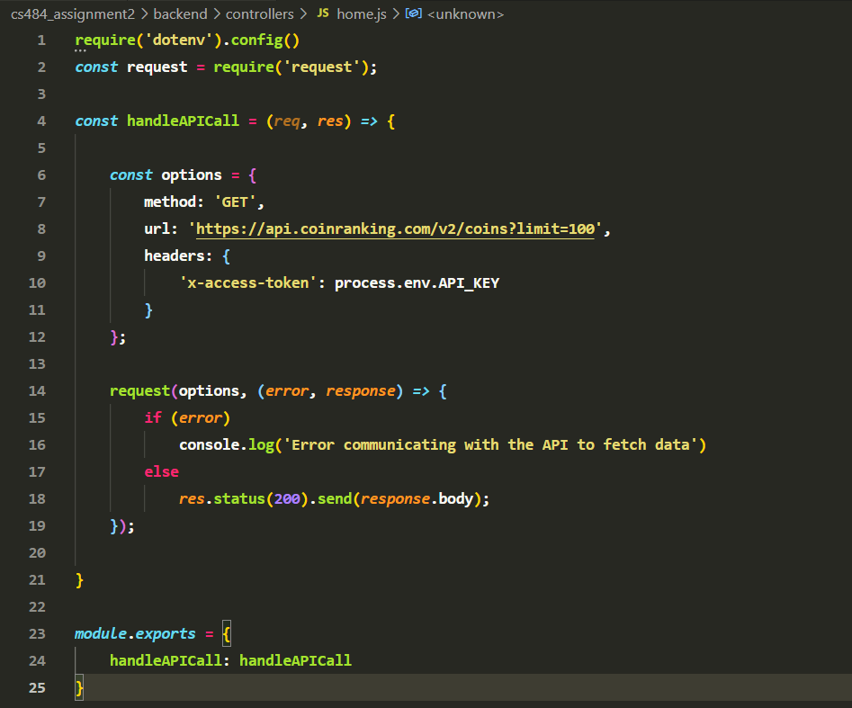

# Cryptoverse

This is the link to the website: [Cryptoverse](https://cryptoversefront.herokuapp.com)

 ### User authentication & security

 For authentication, I am implementing secure storage of passwords through salting the hashes to add an element of randomness. I am also enforcing strong passwords by accepting only passwords that contain a lowercase, uppercase, number and a special character. The minimum length of the password is also 8 characters.    
 For security, I have implemented a microservices-based architecture. My frontend manages all user interactions, and it contains no sensitive data at all. I have a backend server that contains all the sensitive data and communicates only what is required at any point in time to the frontend, which also manages to keep the frontend light and fast.    
 I have used object relational mapping through a library called knex.js to prevent SQL injection attacks. My server also has a cors module that allows only my frontend to connect with it through a parameter called 'origin'. This implies no one else in the world can access my server at the url. The server will also sit in its own docker container, so essentially it'll be in a world of its own.    
 I also a separate .env file where I store sensitive data. For the purpose of grading, I have uploaded that file as well, but ideally I will put that in gitignore and keep it safe and secure in my laptop.

### API

I use the coinranking API to obtain data about crypto. This is the link to the documentation:
[https://developers.coinranking.com/api/documentation/coins](https://developers.coinranking.com/api/documentation/coins)      

### Challenges

Wow, where do I begin. Here is a small list:  
Sessions - it took me quite a while to figure out a way to communicate sessions between my frontend and backend. It got a ton harder after deploying it to heroku, since my websites went from http to https-based, so sessions stopped working. Also, Heroku uses something called a reverse proxy and that was getting in the way as well.  
This was definitely one of the hardest challenges as there was no help on the internet as well. I had to spend hours tweaking parameters of the session, cookie and finally found out that this worked:  
app.set ('trust proxy', 1)  
cookie: { sameSite: 'none', secure: true, httpOnly: true }

### Tools and Resources

These are the primary technologies that were used to build this full-stack application:   
Html, CSS, Javascript  
React.js  
Node.js, Express.js  
Jest.js  
Knex.js  
Sqlite3  
Github Actions for CI/CD  
Docker  
Heroku  

These are some additional libraries I used:   
React Sparklines  
React Tilt  
Nodemailer  
Knex.js  
Bcrypt.js  

## Production mode

Please note that the app has been deployed so it will not work in development mode as ports and urls in the .env file have been changed.
Heroku has some weird sleep mode in the free plan, so it may take a while for the website to load. Please be patient.
This is the url to the frontend - [https://cryptoversefront.herokuapp.com/](https://cryptoversefront.herokuapp.com/)
This is the url to the backend - [https://cryptoverseback.herokuapp.com/](https://cryptoverseback.herokuapp.com/)

## Backend

The server has been built using node.js and express.js.

### `npm start` starts the server

cd into the backend folder and type 'npm install' followed by 'npm start'. This will start the server.
The server runs on port 3001. Please start the server before starting the frontend.
Keep this open in one terminal window.

### `npm test` starts the test scripts

cd into the backend folder and type 'npm test'.
There is a file called validation.test.js. This validates the inputs entered by the user in the sign up form.

### `erd diagram` represents the database schema implemented   

### `charts`

I am using a library called react-sparklines for the charting requirement. I get sparkline data from the api which is then fed into the
react-sparklines library, and this renders a chart based on the latest array of prices of the cryptocurrency.

### `session`

I am using a library called 'knex' to facilitate database operations. express-session supports a library called connect-session-knex, I
use this to store the session in the database.

## Frontend

The frontend has been built using React.js.

### `npm start` starts the react scripts

cd into the frontend folder and type 'npm install' followed by 'npm start'. This starts the react scripts and runs the app in development mode.
React defaults to port 3000.
Open [http://localhost:3000](http://localhost:3000) to view it in the browser.

### `npm test` starts the test scripts

cd into the frontend folder and type 'npm test'. This will run a react test script.
The file that is run is the app.test.js present inside the containers folder.
This basically checks if the app.js contains a div element with class name of 'App'.
Although this seems like a basic test, it is absolutely vital, as this div element is the parent frontend element that contains everything.

### `responsiveness`

All the pages in the application are responsive to all screen sizes.